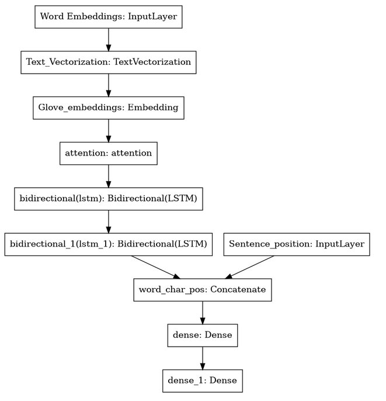

# Annotate Sections in Unstructured Medical Abstracts

## Introduction

Close to two million works of medicals literatures are published each year.
Due to the increasing number of publications, the researchers need special
tools to skim through the literature. It is difficult to extract relevant
information quickly from an unstructured abstract. Accessing information
from the literature will be easier if the abstract of the literature is
structured. This project aims to annotate each sentence in
randomized controlled trials medical abstracts into their appropriate
sections thereby helping the researchers to collect the required
information expeditiously. 

## Data

The model is trained using the PubMed RCT 200K dataset which is described in  *Franck Dernoncourt, Ji Young Lee. [PubMed 200k RCT: a Dataset for Sequential Sentence Classification in Medical Abstracts](https://arxiv.org/abs/1710.06071). International Joint Conference on Natural Language Processing (IJCNLP). 2017.* The dataset consists of approximately 200,000 medical abstracts of randomized controlled trails (RTC). 

The proprocessed data consists of text, target and position of the sentences in an abstract. The position of the sentence in an abstract if scalled between 1 to 5.

## Model Architecture

The model Contains an attention layer, followed by two Bi-directional LSTM layers. The output for Bi-LSTM layer is concatinated with sentence position feature (one hot vector). The output of concatinated layers if fed into a fully connected layer with 128 neurons followed by an output layer that contains 5 neurons (5 output classes).

<p align="center">
  
</p>


## Run my project

You can make predictions on CLI or using an web interface. To use the flask web interface run program as follows

```bash
export FLASK_APP=app.py
flask run --host=0.0.0.0 # this will serve at port 5000 (default)
```
the flask web interface will look as follows, 


<p align="center">
  
</p>


or to make predictions on CLI, run the predict.py as follows,


```bash
python predict.py
```
Prediction in CLI looks as follows,

<p align="center">
  
</p>

## Requirements

- [Python](https://www.python.org/downloads/) >= 3.7
- [Tensorflow](https://www.tensorflow.org/install) >= 2.4
- [nltk](https://numpy.org/install/) >= 3.6
- [Numpy](https://github.com/facebookresearch/fastText) = 1.19 (numpy > 1.19 gives some index error with tensorflow v2)
- [Flask](https://flask.palletsprojects.com/en/2.0.x/) >= 2.0


## Bugs and Future Improvements

- The sentence position feature has high influence on model predictions.  
- A more sophisticated model like Transformers, or BERT models can be used to make predictions without relying on sentence position feature.  
